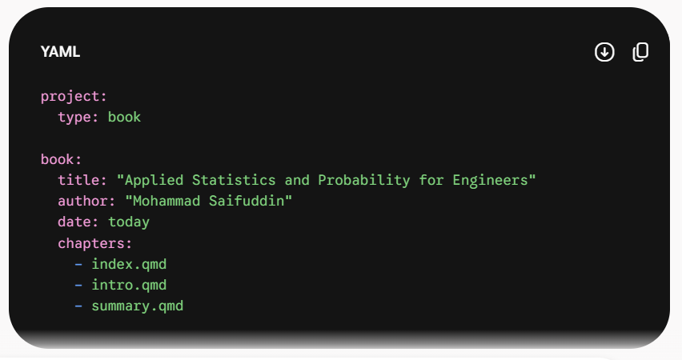
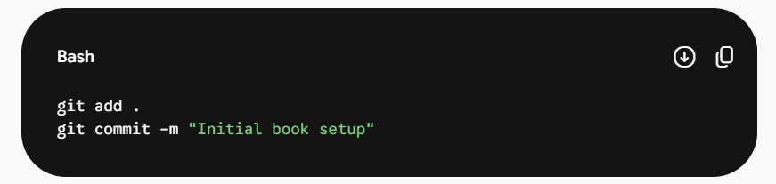
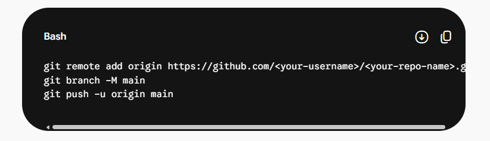
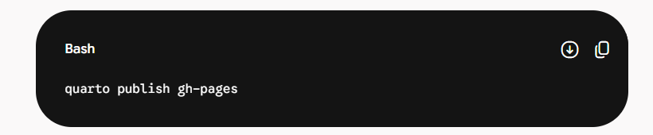
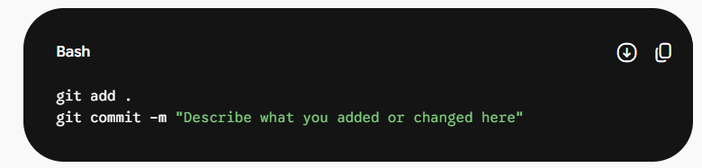
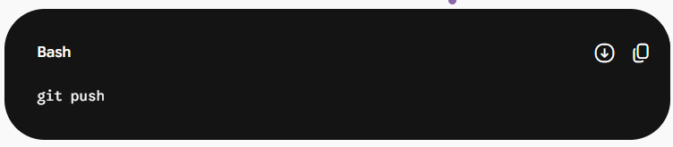
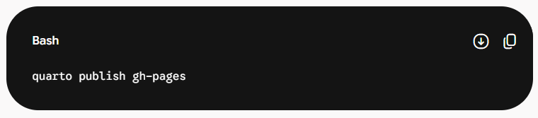

Here is the complete, start-to-finish workflow for creating, configuring, and publishing a Quarto book using RStudio and GitHub. You can save this as a reference guide for your current and future eBook projects.

# Phase 1: Local Project Setup

1.  **Create the Project Directory**

    - Open RStudio and navigate to **File \> New Project \> New Directory \> Quarto Book**.

    - **Crucial:** Name your directory using hyphens or underscores, with no spaces (e.g., `applied-statistics-probability-engineers`). Spaces can break command-line tools and LaTeX rendering.

    - Check the boxes for **Create a git repository** and your preferred engine (e.g., **Knitr**).

    - Click **Create Project**.

2.  **Configure the Book Details**

    - Open the `_quarto.yml` file. This is the brain of your book.

    - Set your human-readable title, author details, and ensure there are no duplicate top-level keys (like having `format:` listed twice).

    - *Example structure:*

# Phase 2: Version Control (Git & GitHub)

1.  **Commit Files Locally**

    - Open the **Terminal** tab in RStudio (bottom-left pane).

    - Track and commit your initial files by running:

- **Create the Remote Repository**

  - Go to GitHub.com and create a **New Repository**.

  - Name it to match your folder (e.g., `applied-statistics-probability-engineers`).

  - **Crucial:** Leave the repository completely blank. Do *not* check the boxes to add a README, .gitignore, or License.

- **Link and Push**

  - Copy the terminal commands provided by GitHub under the section titled *"...or push an existing repository from the command line"*.

  - Paste them into your RStudio Terminal. It will look like this:

# Phase 3: Publishing to the Web

1.  **Render and Publish via Quarto**

    - In your RStudio Terminal, run the built-in publishing command:

- Quarto will automatically render your `.qmd` files into HTML, push them to a hidden `gh-pages` branch on your GitHub repository, and configure GitHub Pages to host your live website.

- A browser window will open automatically with your live URL.

# Phase 4: The Daily Update Workflow

Whenever you write a new chapter, edit `_quarto.yml`, or add local files (like PNG diagrams or datasets), follow this three-step cycle to update your live book:

1.  **Save and Commit**

    - Save your files in RStudio.

    - In the Terminal, run:

**Push Code to GitHub**

- Send your source code updates to your main repository:

**Update the Live Website**

- Tell Quarto to rebuild the HTML and update the public link:

